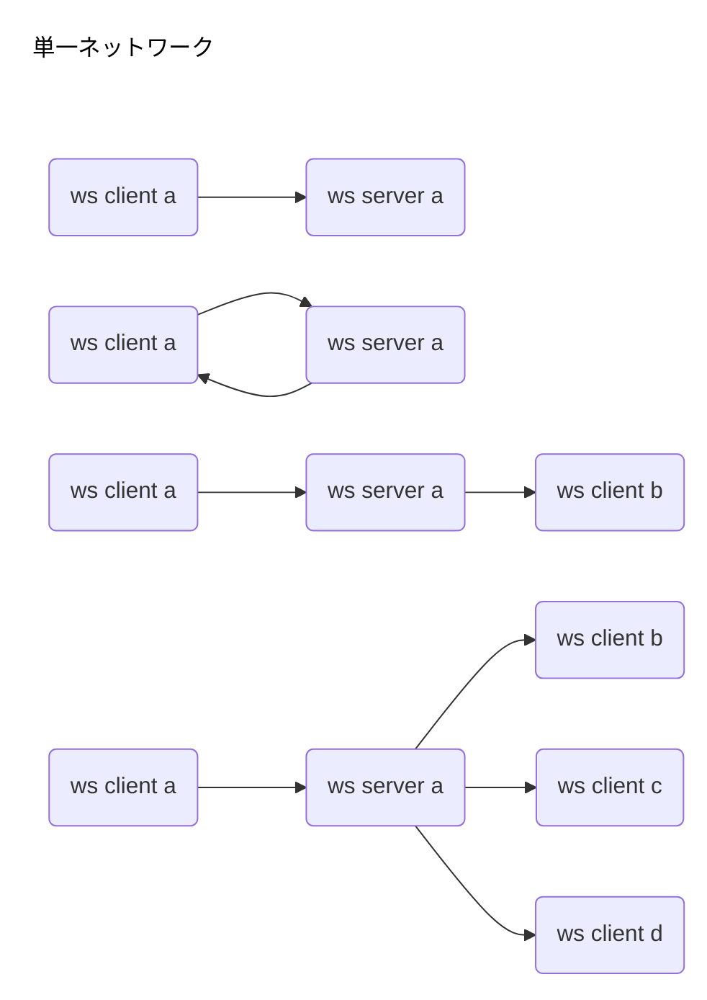

# w2w
Tool for WebSocket to WebSocket


### サイト準備
https://w2w.info/

### 構築後のフロー




### test

```

凡例 通信方向
------------------------------------------------------------------------------
sa->ca サーバーaからクライアントaへ送信する
sb->cb サーバーbからクライアントbへ送信する
ca->sa  クライアントaからサーバーaへ送信する
ca->sa->ca  クライアントaからサーバーaへ送信し、サーバーaからクライアントaへ返信する
ca->sa->cb  クライアントaからサーバーaへ送信し、サーバーaからクライアントbへ送信する
------------------------------------------------------------------------------

w2w.info\html>npm run test

> w2w@1.0.0 test
> mocha


  WebSocketサーバーからの受信
    ✔ sa->ca: wss://reien.top:3333 から"Response from 3333"を受信できた (181ms)
    ✔ sb->cb: wss://reien.top:3334 から"Response from 3334"を受信できた (102ms)
    ✔ ca->sa->ca: wss://reien.top:3333 へsendして結果を受け取った。"A to 3333 to A"を受信できた


  3 passing (285ms)
```

### ca->sa->cb 違うクライアントへ送る場合
実現するいくつかの方法がある。
オプションで選択で聞くようにするか？どういうオプションが使いやすいか？
<ol>
<li>clientへの配信方法
<ol>
    <li>wss Serverでブロードキャストする方法
    <li>cbを特定して送る方法。
</ol>
<li>clientを特定する仕組み
<ol>
    <li>ipを記憶
    <li>idを作る
</ol>
<li>idを作るタイミング1
<ol>
    <li>クライアント側　
    <li>サーバー側
</ol>
<li>idを作るタイミング2
<ol>
    <li>サブプロトコル
    <li>サーバー側 onmessage
</ol>
<li>idを作る方法
<ol>
    <li>uuidv4
    <li>sha3やeddsaとか楕円曲
</ol>
</ol>

### memo:


```

2022-07-27
https://twitter.com/toshirot/status/1552300957433995265


https://www.npmjs.com/

.gitignore　を作っておいた

