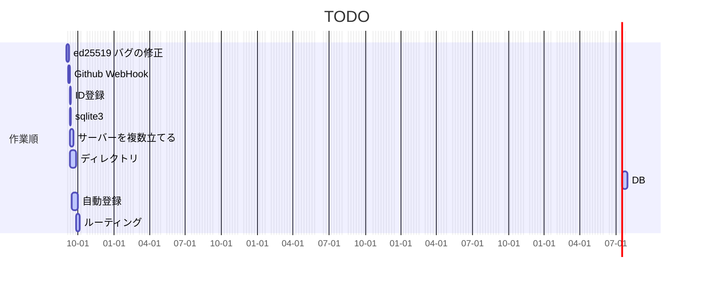
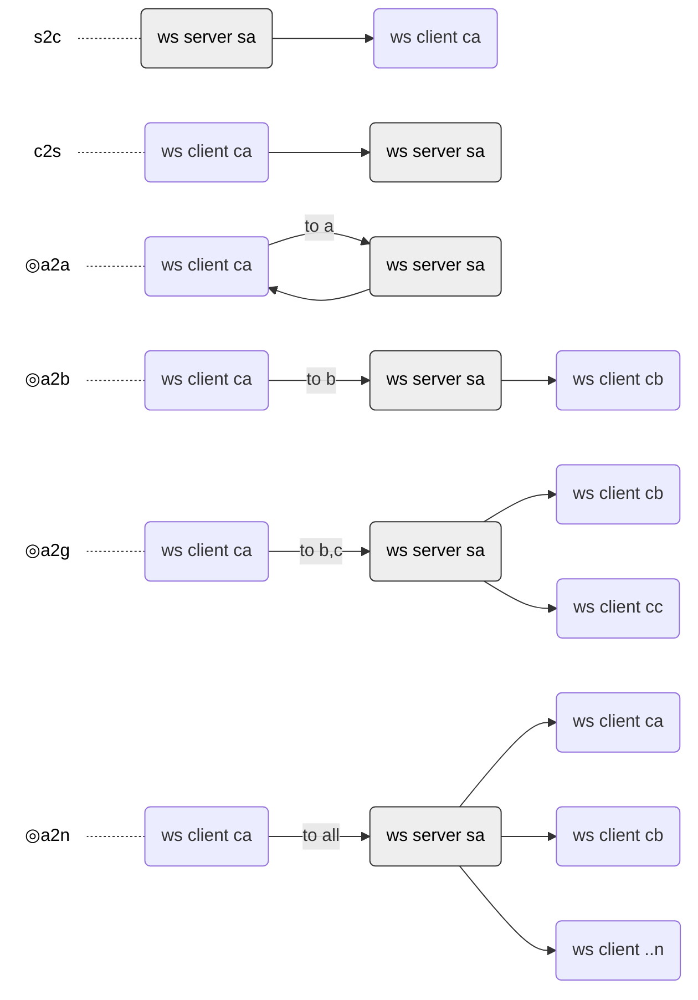
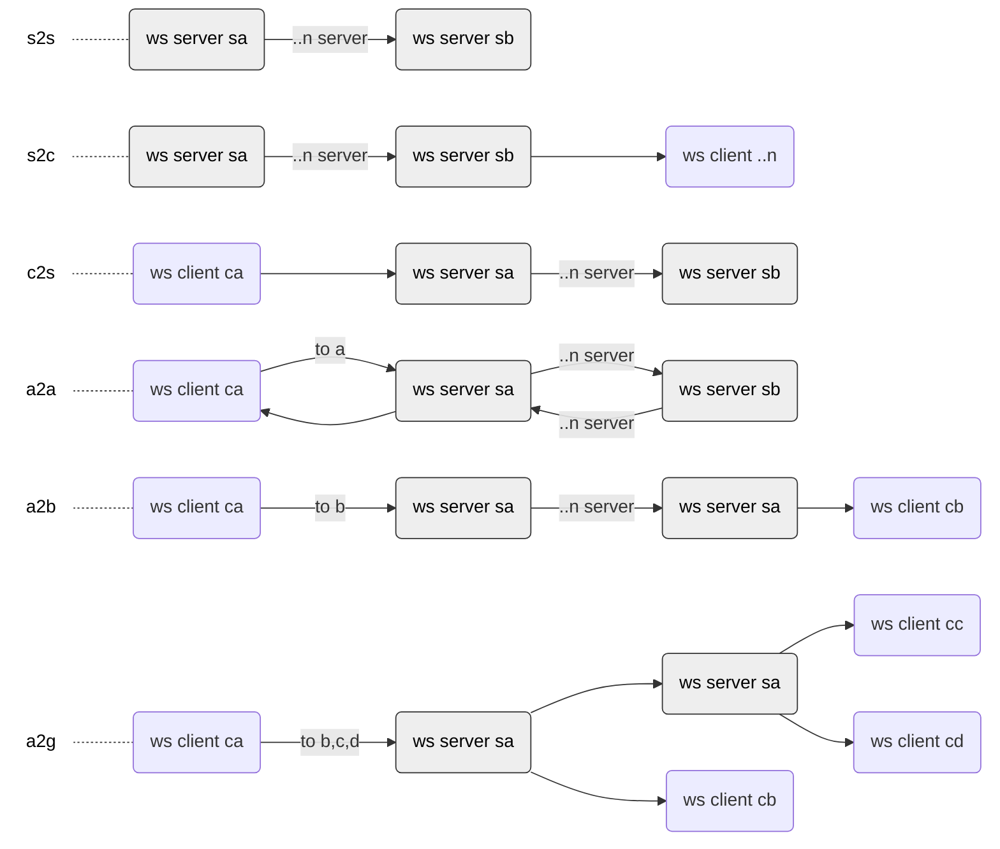
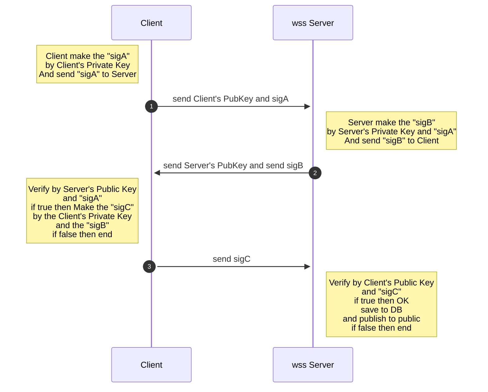
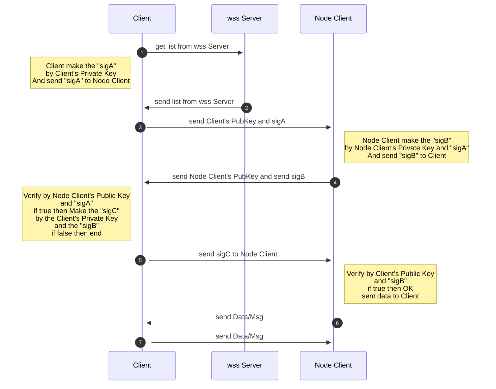
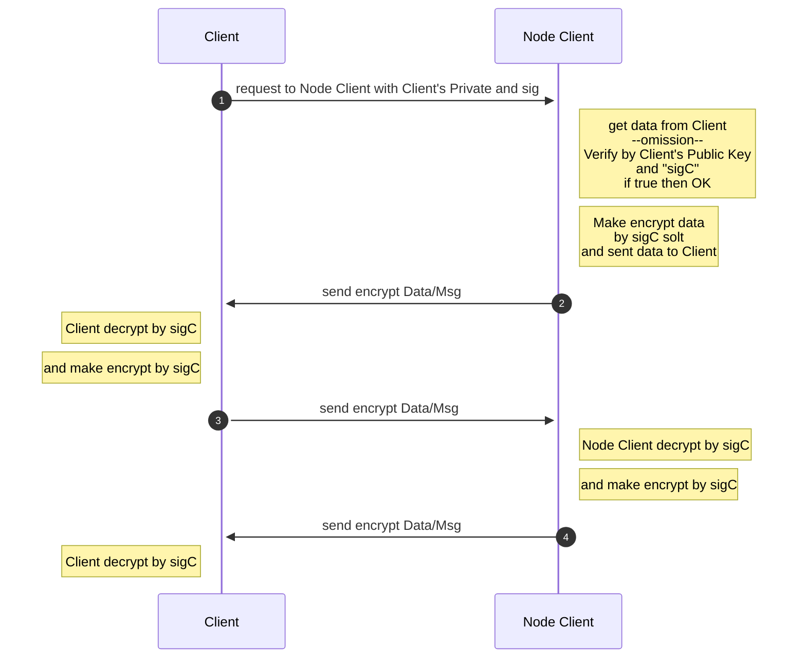
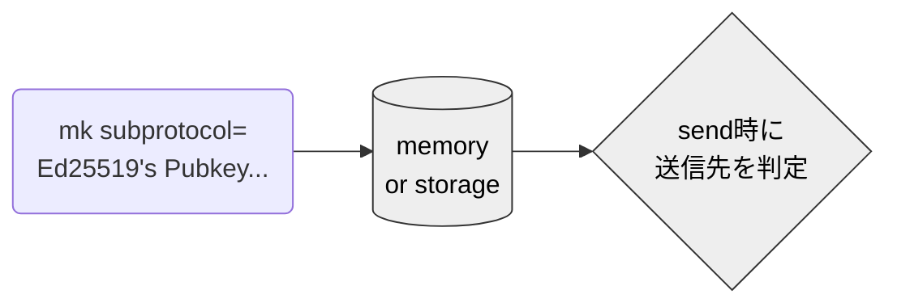

# w2w
Tool for WebSocket to WebSocket. Realizing W2W (WebSocket-to-WebSocket) like P2P. But is not P2P.


### サイト準備
https://w2w.info/

### 動機


Almost ten years have passed 2022 since rfc6455 was published in December 2011, and WebSocket has become a technology that is used daily on the Web.

Still, specifying destinations across multiple WebSocket networks and broadcasts can be cumbersome.

Still, if a transmission destination is specified beyond multiple WebSocket networks or broadcasts, If you do, it will take some time.
What I'm trying to do here is try to think of a way to provide them in the most straightforward, safest, and most uniform way possible.

I want to enjoy working while testing various things.

WebSocketも [rfc6455](https://datatracker.ietf.org/doc/rfc6455/) が2011年12月に公開されてから2022年でほぼ10年が経過し、Webでは日常的に使われる技術となってきています。

一般的な使われ方は、常時接続のリアルタイム送受信をClient/Server型の単一ネットワーク内で行うものが多いのですが、もし、複数のWebSocketネットワークを超えて送信先を指定したりブロードキャストで放送したりするとしたら少し手間がかかります。

ここで行おうとしているのは、それらをなるべく簡単で安全に統一的な方法で提供する方法を考えてみたいということです。

いろいろテストしながら、楽しみつつ作業をしていきたいなと思っています。


### TODO
<ol>
<li><s>ed25519 バグの修正 https://github.com/toshirot/w2w/issues/4</s>
<li><s>github web hook for w2w.info</s>
<li><s>「参加処理 ID登録」をsigCまでの手順でやってみる</s>
<li><s>DBとしてSQLite3を試す(高速、シンプル、ロックしても繋ぎなおせば良い)</s>
<li>サーバーを複数立てて転送を試す
<li>サーバーが接続してきたときに自動登録する仕組みを考える
<li>複数ネットワーク時の効率の良いルーティング手順を決める
<li>ディレクトリにサーバー側も入れて書き直す
<li>a2g (sent to gloup)で配列リストにグループ名をSlackチャンネルのように付けられると良いかもしれない
<li>a2g (sent to gloup)でグループメンバーの検証をするケースと単に宛先を複数指定するケースは別かもしれない。今は後者でテストしてる。
<li>そろそろ dev_branchを作って作業したほうが良いかな
</ol>

<a name=gantt></a>



### 最新のTEST状況

```

凡例 通信方向
------------------------------------------------------------------------------
reply: at onconnected 最初のsig 自分自身へ返す 
a2a: at onmsg, client から server へ送信し、更に、同じ client へ返信する
a2b: at onmsg, client から server へ送信し、更に、別の client へ送信する
a2g: at onmsg, client から server へ送信し、更に、複数の指定した client へ送信する
a2n: at onmsg, client から server へ送信し、更に、接続してる全 client へ送信する
------------------------------------------------------------------------------

w2w.info\html>npm run test

> w2w@1.0.0 test
> mocha

  新しいAccountの作成
    ✔ 一旦古いアカウントを削除した
    ✔ 新しいアカウントを作製した

  WebSocketサーバーへsendし返信を受け取る
    ✔ a2a: wss://w2w.info:3333 へsendし返信を受け取った

  参加処理 ID登録 sigA から sigC を交換し verifyする
    ✔ sigA、sigB、sigCをサーバーと交換しお互いに verify して true だった (142ms)

  signの作成とveryfy
    ✔ sign した signature は期待通りの値で、verify は true だった

  sqlite3の動作確認
    ✔ CREATE TABLE、INSERTし、SELECTした

  WebSocketサーバーとの各種送受信
    ✔ replyBack: "reply from wss://w2w.info:3333"を受信できた (78ms)
    ✔ replyBack: "reply from wss://w2w.info:3334"を受信できた (77ms)
    ✔ a2a: wss://w2w.info:3333 へsendして結果を受け取った。"a2a hello w2w"を受信できた
    ✔ a2b: wss://w2w.info:3333 へsendして cb が結果を受け取った。"a2b hello w2w"を受信できた
    ✔ a2g: client a,b,c があるときに to [b,c] へ送り b,c だけが受け取った。
    ✔ a2n: client a,b,c があるときに to n(all) へ送り 全員が受け取った。


  12 passing (410ms)
```

### 想定している実装環境
- OS
    Ubuntu ( or Win/Mac )
- フレームワーク
    Node.js
- データベース(現在は only on memory)
    MongoDB
- Client は現状 command line (browserfyなどして将来はブラウザUIもある？)
- wss Server はUbuntu/Node.js/ws

### 経路type
<ul>
    <li>1) at on connect:
        <ul>
        <li>reply replyBack (reply to myself)
        <li>sigA replyBack (reply to myself for sign/verify)
        </ul>
    </li>
</ul>
<ul>
    <li>2) at on message: 
        <ul>
            <li>s2c (sent to client from server)
            <li>c2s (sent to server from client)
            <li>a2a (reply to myself)
            <li>a2b (sent to an other)
            <li>a2g (sent to gloup)
            <li>a2n (sent to all/broadcast)
            <li>s2s (server to server)
        </ul>
    </li>
</ul>

( x2s terminate on last server. )

### 構築後のフロー
<p>※◎はテスト済み</p>

#### at on connect: 自動で返される reply back


#### at on message:1 単一ネットワーク single network



#### at on message:2 複数ネットワーク multiple networks


### 用語の暫定定義

<li><strong>Client:</strong> wssネットワーク上のclient
<li><strong>wss Server:</strong> WebSocketネットワークServer。以下の Node Client を兼ねる。
<li><strong>Node Client:</strong> 参加しているNode List を持つClient。Clientに教える。
<li><strong>Node List:</strong> Node Clientで公開されているClientリスト
<li><strong>ID:</strong> Node List で公開されている各ClientのアカウントIDで公開鍵。


### 機能要件
<p><small>前提： 各通信全てがwssで暗号化されている</small></p>
<br/>
<p><small>動作イメージ： 例えば Client を立ち上げると、以下の「参加処理 ID登録」で自動サインインし、wss Server の Node List にアカウントが登録される。
その後は、「データの取得と提供」により、アカウントを指定して Node Client と接続し、1on1 or 1onN でデータを送受信できる。
「データの暗号化、改竄防止機能」は以下のイメージ。「データの取得と提供」接続時に使った"sigC"をencryptに利用する。
あるいは、a2g,a2nでの放送も可能。
</small></p>
<br/>

<li>参加処理 ID登録
<p><small>Clientは自分の所属しているネットワークの wss Serverと相互のPubkey/署名を交換し、OKなら wss Server はDBへ登録・公開する。公開されるアカウントIDは各Clientの公開鍵です。
この手順を踏むことでなりすましは、できなくなる。
</small></p>



<li>脱退処理
<ol>
    <li>サーバーサイドでのPing/Pongの監視
    <li>Clientからの明確なclose送信
</ol>
<li>冗長化
<li>データの取得と提供（転送）
<p><small>Clientはwss Serverから欲しいデータを持っているNode Clientリストを受け取る。Node Clientへデータを要求し、相互のPubkey/署名を交換して、認証OKならNode ClientはClientへデータを送る。</small></p>


<li>データの暗号化、改竄防止機能
<p><small>Node Clientは、Clientへデータ送信前に "sigC"をsoltとした暗号化を施して送り、Clientは "sigC"で解凍する。</small><p>
<p><small>改竄防止はハッシュで実装できるけど今はいらないかな？</small><p>


<li>データの公開機能
<ol>
    <li>単純なアドレスリストはNode Clientが持つ。
    <li>「私はこういうデータを持っています」という宣言はフォーマットを決めて考慮
</ol>
<li>NAT越え機能
<ul>
    <li>リバースプロクシで443ではだめなの？
</ul>
<li>データのリモート削除機能 (Autonomous なら無しか代替機能)

### 宛先IDアドレスを作り登録するとか

プランA アルゴリズム
<ol>
<li>IDはclientのWebSocket生成時にsubprotocol用にkeypairを作り
<li>keypairはCONF_PATHへ保存する
<li>公開鍵とsigAをwssサーバーへ送信する(send Pub,sigA)
<li>サーバー側では onconnect時に
<li>subprotocolの基礎要件を判定(chkProtocol)して
<li>falseなら接続終了
<li>trueなら更にIDの存在をメモリかDBで確認し(if(hasId(protocol.id))return)
<li>falseならメモリかDBへ登録し、ネゴ　Operation Helheimへ
<li>trueなら何もしない
<li>clientはリストを受け取る(ただの宛先リストと知ってるよリストなどがありうる)
<li>送信時にはリストから宛先を判定し
<li>(要：知ってるリストの問い合わせ方法)
<li>知ってるリストがあればそこへ送信する
<li>知ってるリストが無ければどうするのが良いか
<li>接続している wss Server 同士は socket.w2w_client を時々同期する
<li>全リストを持つのは無駄なのでアドレスを番地分けしておきたい。
<li>※サーバーが接続してきたときに登録する仕組みを考える
</ol>
Operation Helheim: sigA2sigB2sigC アルゴリズム
<p><small>Client is ALICE, wss Server is BOB.</small></p>
<ol>
<li>ALICE: wssサーバーに接続し、公開鍵(BOB's Address)を取得する
<li>ALICE: 秘密鍵とmsgでsigAを作る

`e.g sigA =sign(msg, AlicePriKey)`

<li>ALICE: 公開鍵(Alice's Address)とsigAをwssサーバーBOBへ送信する

`e.g. wss.send(Alice's Address, sigA) //to BOB `

<li>BOB: get 公開鍵(Alice's Address) and sigA

`e.g. let recived=recivedMsg() //from ALICE and get Alice's Address, sigA`

<li>BOB: save 公開鍵(Alice's Address) and sigA to memoly or DB

```
upsert {    
    utime: {type: Number, require:true}
    , addr: {type: String, require:true}
    , sigA: {type: String, require:true}
    , sigB: {type: String, require:true}
    , sigC: {type: String, require:true}    }
```

<li>BOB: "sigB" を "sigA" と BOB's Private Keyで作る

`e.g sigB = sign(sigA, BobPriKey)`

<li>BOB:  upsert to DB, sigB where Alice's Address

`e.g upsert sigB where Alice's addr`

<li>BOB: sigBをAliceへ送信する

`e.g. wss.send(sigB) //to ALICE  `

<li>ALICE: get sigB

`e.g. let recived=recivedMsg() //from BOB get sigB`

<li>ALICE: verify sigA and sigB by Bobの公開鍵(BOB's Address)

`let res:{bool} = verify(sigA, sigB, BobPubKey)`

<li>ALICE: res is true then  Make the "sigC" by the Alice's Private Key and the "sigB".
and send to Bob

```
if(res){
        sigC = sign(sigB, AlicePriKey)
        wss.send(sigC) //to BOB 
} else {
        //goto 1
} 
```
<li>BOB: get sigC

`e.g. let recived=recivedMsg() //from ALICE get sigC`

<li>BOB: find sigB from DB by Alice's addr, and Verify  sigB and sigC by Alice's Public Key.

`let res:{bool} = verify(sigB, sigC, AlicePubKey)`

<li>BOB: if res is then Alice's SignIn is OK, and send msg(status OK) to ALICE

```
if(res){
        upsert to DB, sigC where Alice's Address
        ss.send(status OK) //to ALICE 
} else {
        //goto 1
} 
```
<li>honor to okarin
</ol>


### id検索する手順案のメモ1
<ol>
<li>client が server へ接続すると server は client id を id-url なリストへ登録する

```
CREATE TABLE IF NOT EXISTS id-url(id STRING, url STRING, utime INTEGER)'
```
<li>server は client へ  id-url なリストを返す
<li>検索時： client は 自分の id-url なリストに idがあれば、そのurl へ接続し a2b などを送る
<li>無ければ、client は  server へ a2bやa2nなどで id を to としてリクエストする
<li>server は持っている  id-url リストに  id があればその id へ msg を送る
<li>無ければ、まず、自分のネットワーク内の全 client に broadcast で問い合わせる
<li>各クライアントは、持っている  id-url リストに  id があればその id へ msg を送る/ serverへ送るべき？
この件は、msgが大きい場合もあるのでとりま id-url を serverへ送るべきな気がする
<li>各クライアントは、無ければ has not の返事をする？
<li>server は 各clientに無ければ、自分の持っている url リストへ問い合わせる

```
CREATE TABLE IF NOT EXISTS url(url STRING, utime INTEGER) //server 接続時に追記する
```
<li>問い合わせを受けた各 url は 持っている  id-url リストに id があれば has レスポンスを返す
<li>各 url は 無ければ無視
<li>
</ol>

### 例えば ca->sa->cb 違うクライアントへ送る場合の選択肢メモ
実現するいくつかの方法がある。
オプションで選択で聞くようにするか？どういうオプションが使いやすいか？

<br> ✔は2022-08-18 テスト実装
<br>
<ol>
<li>clientへの配信方法
<ol>
    <li>wss Serverでブロードキャストする方法
    <li>cbを特定して送る方法。 ✔
</ol>
<li>clientを特定する仕組み
<ol>
    <li>ipを記憶
    <li>idを作る ✔
</ol>
<li>idを作るタイミング1
<ol>
    <li>クライアント側　 ✔
    <li>サーバー側
</ol>
<li>idを作るタイミング2
<ol>
    <li>サブプロトコル ✔
    <li>サーバー側 onmessage
</ol>
<li>idを作る方法
<ol>
    <li>暫定text 
    <li>uuidv4
    <li>uuidv4+SHA224
    <li>sha3とか
    <li>Ed25519 楕円曲線 ✔
</ol>
</ol>

### memo:


```
2022-08-21
暫定send フォーマット {to,from,type,msg}
2022-08-20
仮にAES使うならこんな感じ
CryptoJS.AES.encrypt(CryptoJS.enc.Utf8.parse(msgs), sigC).toString()
CryptoJS.AES.decrypt(msgs, sigC).toString(CryptoJS.enc.Utf8);

2022-08-18
無限ループの止め方

2022-07-27
https://twitter.com/toshirot/status/1552300957433995265


https://www.npmjs.com/

.gitignore　を作っておいた
```

### 参考

<li>WebSocket Server https://github.com/websockets/ws
<li>WebSockets - Web 関連仕様 日本語訳 https://triple-underscore.github.io/WebSocket-ja.html
<li>RFC6455 The WebSocket Protocol 日本語訳 https://triple-underscore.github.io/RFC6455-ja.html
<li>RFC6455 The WebSocket Protocol https://www.rfc-editor.org/rfc/rfc6455
<li>WebSocket のセキュリティ 日本語 — Switch to English https://devcenter.heroku.com/ja/articles/websocket-security
<li>Hybrid P2P型とPure P2P型 https://internet.watch.impress.co.jp/www/column/wp2p/wp2p01.htm
    
```
    >Hybrid P2P型:誰がどんな情報を持っているかを把握したサーバーがあり、最初はそこに接続しに行って、Peerを発見する
    >Pure P2P型: 言ゲームの要領で、ネットワーク中のPeerを芋づる式に検索する
```
<li>wiki P2P https://ja.wikipedia.org/wiki/Peer_to_Peer

<li>先人達 2011.11.20 [P2P]Websocketでブラウザ間P2P通信は実現できるか？(その2) http://toremoro.tea-nifty.com/tomos_hotline/2011/11/p2pwebsocketp2p.html
<li>先人達 2011-11-05 WebSocketを使ってWebブラウザ間P2P通信をしてみた https://yogit.hatenadiary.org/entry/20111105/1320492134
<li>SSDP (Simple Service Discovery Protocol) https://datatracker.ietf.org/doc/html/draft-cai-ssdp-v1-03
<li> P2P通信でNatを越える https://qiita.com/nekobato/items/86e83d40b9d1a4d9b446 #Qiita 
<li> node-ssdp https://www.npmjs.com/package/node-ssdp
<li>memo Set Phasers to STUN/TURN: Getting Started with WebRTC using Node.js, Socket.io and Twilio’s NAT Traversal Service https://www.twilio.com/blog/2014/12/set-phasers-to-stunturn-getting-started-with-webrtc-using-node-js-socket-io-and-twilios-nat-traversal-service.html @twilioより 

<li>mermaid https://mermaid-js.github.io/mermaid/#/
<li>暗号検証 https://emn178.github.io/online-tools/
<li>暗号スイートの暗号強度と、公開鍵のビット数の設定 https://http2.try-and-test.net/ecdhe.html
<li>サーバ負荷をRSAとECDSAで比較 https://http2.try-and-test.net/ecdsa.html
<li>Node Doc https://nodejs.org/dist/latest-v16.x/docs/api/
<li>http://masterwiki.net/steinsgate/index.php?%C7%AF%C9%BD

<hr>
<li>npm ws https://www.npmjs.com/package/ws#websocket-compression　https://github.com/websockets/ws/blob/HEAD/doc/ws.md#new-websocketserveroptions-callback
<li>npm validator (予定) https://github.com/validatorjs/validator.js
<li>npm crypto-js (未使用 cryptoを使ってる)
