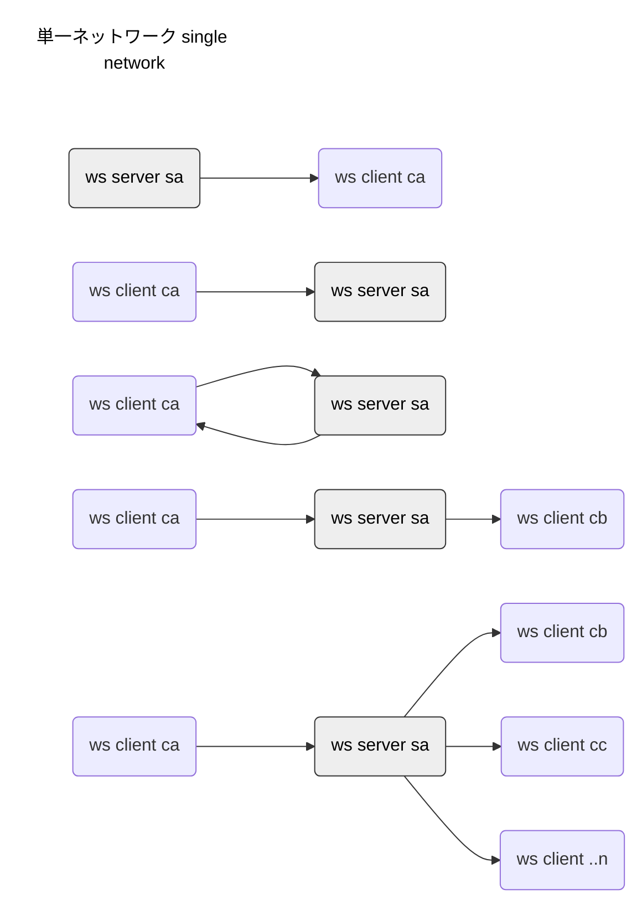
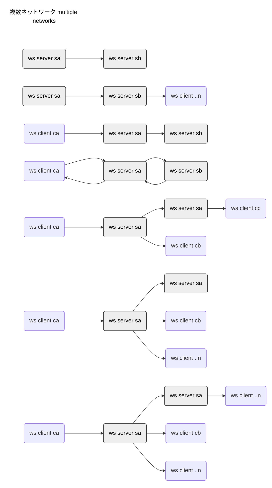
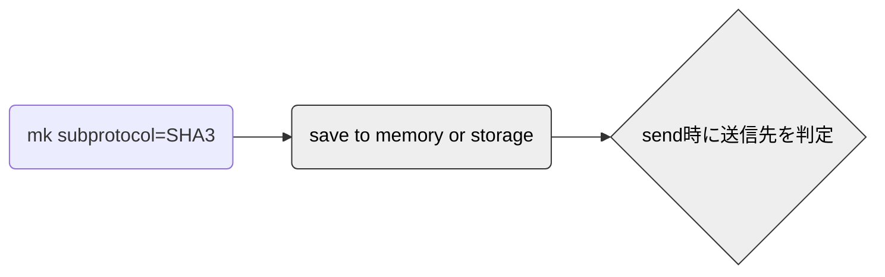

# w2w
Tool for WebSocket to WebSocket. Realizing W2W (WebSocket-to-WebSocket) like P2P

### サイト準備
https://w2w.info/

### 構築後のフロー





### 機能要件

<li>参加処理 ID登録 
<li>脱退処理
<li>冗長化
<li>データの取得と提供（転送）
<li>データの暗号化、改竄防止機能
<li>データの公開機能
<li>NAT越え機能
<li>データのリモート削除機能 (Autonomous なら無しか代替機能)

### 宛先IDアドレスの作り方(ブロードキャストでは使わない)

プランA アルゴリズム
<ol>
<li>IDはclientのWebSocket生成時にsubprotocolとしてハッシュ(sha3やeddsaなど)を作り
<li>wssサーバーへ送信する
<li>サーバー側では onconnect時にsubprotocolの基礎要件を判定して
<li>falseなら接続終了
<li>trueなら更にIDの存在を（とりまメモリかDBで）確認し
<li>falseならメモリかDBへ登録する
<li>trueなら何もしない
<li>送信時に宛先を判定し
<li>(要：知ってるリストの問い合わせ方法)
<li>知ってるリストがあればそこへ送信する
<li>知ってるリストが無ければどうするのが良いか
</ol>



### test

```

凡例 通信方向
------------------------------------------------------------------------------
sa->ca サーバーaからクライアントaへ送信する
sb->cb サーバーbからクライアントbへ送信する
ca->sa  クライアントaからサーバーaへ送信する
ca->sa->ca  クライアントaからサーバーaへ送信し、サーバーaからクライアントaへ返信する
ca->sa->cb  クライアントaからサーバーaへ送信し、サーバーaからクライアントbへ送信する
------------------------------------------------------------------------------

w2w.info\html>npm run test

> w2w@1.0.0 test
> mocha


  WebSocketサーバーからの受信
    ✔ sa->ca: wss://reien.top:3333 から"Response from 3333"を受信できた (333ms)
    ✔ sb->cb: wss://reien.top:3334 から"Response from 3334"を受信できた (289ms)
    ✔ ca->sa->ca: wss://reien.top:3333 へsendして結果を受け取った。"ca to 3333 to ca"を受信できた
    ✔ ca->sa->cb: ca から wss://reien.top:3333 へsendして cb が結果を受け取った。"ca to 3333 to cb"を受信できた


  3 passing (285ms)
```

### ca->sa->cb 違うクライアントへ送る場合
実現するいくつかの方法がある。
オプションで選択で聞くようにするか？どういうオプションが使いやすいか？
<ol>
<li>clientへの配信方法
<ol>
    <li>wss Serverでブロードキャストする方法
    <li>cbを特定して送る方法。
</ol>
<li>clientを特定する仕組み
<ol>
    <li>ipを記憶
    <li>idを作る
</ol>
<li>idを作るタイミング1
<ol>
    <li>クライアント側　
    <li>サーバー側
</ol>
<li>idを作るタイミング2
<ol>
    <li>サブプロトコル
    <li>サーバー側 onmessage
</ol>
<li>idを作る方法
<ol>
    <li>uuidv4
    <li>sha3やeddsaとか楕円曲
</ol>
</ol>

### memo:


```

2022-08-18
無限ループの止め方

2022-07-27
https://twitter.com/toshirot/status/1552300957433995265


https://www.npmjs.com/

.gitignore　を作っておいた
```

### 参考

<li>WebSocket Server https://github.com/websockets/ws
<li>WebSockets - Web 関連仕様 日本語訳 https://triple-underscore.github.io/WebSocket-ja.html
<li>RFC6455 The WebSocket Protocol 日本語訳 https://triple-underscore.github.io/RFC6455-ja.html
<li>RFC6455 The WebSocket Protocol https://www.rfc-editor.org/rfc/rfc6455
<li>WebSocket のセキュリティ 日本語 — Switch to English https://devcenter.heroku.com/ja/articles/websocket-security
<li>Hybrid P2P型とPure P2P型 https://internet.watch.impress.co.jp/www/column/wp2p/wp2p01.htm
    
```
    >Hybrid P2P型:誰がどんな情報を持っているかを把握したサーバーがあり、最初はそこに接続しに行って、Peerを発見する
    >Pure P2P型: 言ゲームの要領で、ネットワーク中のPeerを芋づる式に検索する
```
<li>wiki P2P https://ja.wikipedia.org/wiki/Peer_to_Peer

<li>先人達 2011.11.20 [P2P]Websocketでブラウザ間P2P通信は実現できるか？(その2) http://toremoro.tea-nifty.com/tomos_hotline/2011/11/p2pwebsocketp2p.html
<li>先人達 2011-11-05 WebSocketを使ってWebブラウザ間P2P通信をしてみた https://yogit.hatenadiary.org/entry/20111105/1320492134

<li> P2P通信でNatを越える https://qiita.com/nekobato/items/86e83d40b9d1a4d9b446 #Qiita 

<li>memo Set Phasers to STUN/TURN: Getting Started with WebRTC using Node.js, Socket.io and Twilio’s NAT Traversal Service https://www.twilio.com/blog/2014/12/set-phasers-to-stunturn-getting-started-with-webrtc-using-node-js-socket-io-and-twilios-nat-traversal-service.html @twilioより 

<li>mermaid https://mermaid-js.github.io/mermaid/#/
<li>暗号検証 https://emn178.github.io/online-tools/